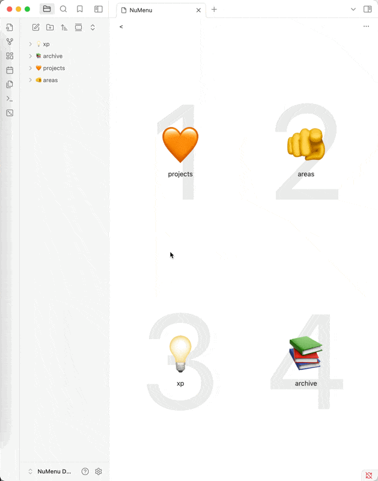

## Numenu
**Speedy Navigation for Obsidian**

> ⚠️ This plugin is currently in alpha. Features and functionality may change.

## Navigate through your notes with ease!
Numenu brings the classic gaming-style numeric menu navigation to your Obsidian experience.

## 🔑 Key Features:
- Lightning-fast navigation using numeric hotkeys
- Intuitive menu structure inspired by retro gaming
- Keyboard-focused operation, no mouse required
- Customizable shortcuts for your most-used actions
- Smart emoji detection in folder/file names for visual organization
- Flexible menu arrangement via drag & drop

Inspired by classic gaming interfaces, Numenu makes navigation in Obsidian more efficient and enjoyable. Perfect for power users and keyboard shortcut enthusiasts.

## 🎮 How to Use:
- Press [Hotkey] to open the menu
- Navigate using numbers 1-9
- Instant access to your most important notes and functions
- Add emojis at the start of folder/file names for visual categorization (e.g., 📚 Books, 💡 Ideas)
- Customize your menu order by dragging and dropping items

## 💡 Pro Tip: Ideal for keyboard-first workflows and rapid note navigation.

## 🔧 Installation

1. Open Obsidian Settings
2. Go to Community Plugins and disable Safe Mode
3. Click Browse and search for "Numenu"
4. Install the plugin and enable it (comming hopfully soon!)

For manual installation:
1. Download the latest release from the releases page
2. Extract the files into your `.obsidian/plugins/numenu/` folder
3. Reload Obsidian
4. Enable the plugin in Community Plugins settings